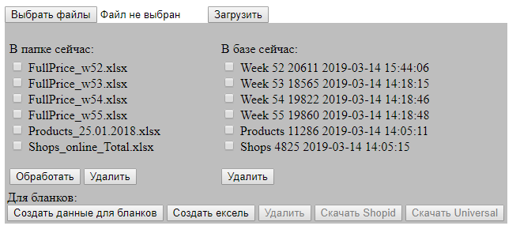

# kmprov.loc
 <b>Задача:</b>
 Есть три вида excel файлов (Fullprice, Products, Shops) которые нужно добавить в БД.
 Иметь возможность ненужные данные удалять.
 Определенным образом данные в БД обработать и из них сгенерировать два отчета (Shopid, Universal) в формате XLSX.

  

 <b>Установка:</b>
 Импортировать в БД файл - keymarket.sql;
 Заполнить файл конфигурации входа в БД - \config\db.php;
 composer install;

 <b>Использовались пакеты:</b>
 <b>"pclzip/pclzip"</b> - для обработки XLSX файлов;
 <b>"mk-j/php_xlsxwriter"</b> - для записи файлов XLSX;
